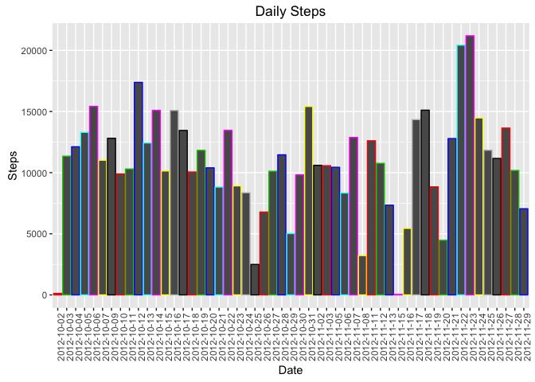
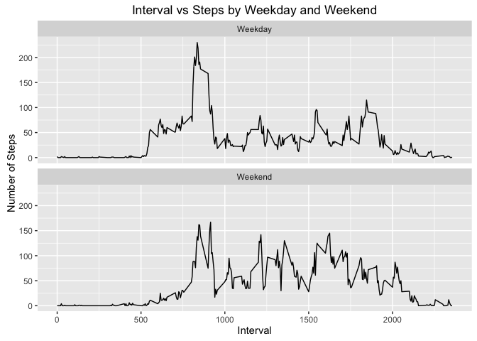

# Reproducible Research: Peer Assessment 1
## Ramesh Doraiswamy March 31, 2016

## Loading and preprocessing the data

```r
#Let us remove the variables
rm(list=ls()) # Remove everything from environment
cat("\014")   # Clear Console
```



```r
setwd("/Users/rdoraiswamy/mygit/RepData_PeerAssessment1/");
# Load the necessary packages
library(ggplot2);
# Read the CSV file and store the same
act <- read.table("activity.csv", sep = ",", header = TRUE);
# Let's review the first rows
head(act);
```

```
##   steps       date interval
## 1    NA 2012-10-01        0
## 2    NA 2012-10-01        5
## 3    NA 2012-10-01       10
## 4    NA 2012-10-01       15
## 5    NA 2012-10-01       20
## 6    NA 2012-10-01       25
```

```r
str(act);
```

```
## 'data.frame':	17568 obs. of  3 variables:
##  $ steps   : int  NA NA NA NA NA NA NA NA NA NA ...
##  $ date    : Factor w/ 61 levels "2012-10-01","2012-10-02",..: 1 1 1 1 1 1 1 1 1 1 ...
##  $ interval: int  0 5 10 15 20 25 30 35 40 45 ...
```


## What is mean total number of steps taken per day?

```r
# Let us compute the sum of steps by date
step_sum <- aggregate(. ~ act$date, act[1], sum);
# Let us compute the mean and median of steps
step_mean <- mean(step_sum$steps);
step_median <- median(step_sum$steps);
head(step_sum); # Display the first 6 rows of the step summary
```

```
##     act$date steps
## 1 2012-10-02   126
## 2 2012-10-03 11352
## 3 2012-10-04 12116
## 4 2012-10-05 13294
## 5 2012-10-06 15420
## 6 2012-10-07 11015
```

```r
#Let's print the mean and median
cat("Mean number of steps: ", step_mean);
```

```
## Mean number of steps:  10766.19
```

```r
cat("Median number of steps: ", step_median);
```

```
## Median number of steps:  10765
```

```r
hist(step_sum$steps, col=step_sum$`act$date`, xlab = "Number of Steps per Day", ylab = "Frequency" , main = "Histogram of number of steps", labels = TRUE, ylim = c(0,40));
```


## What is the average daily activity pattern?

```r
#Let us create a new plot
#plot.new();
#Build the plot of steps vs date
g <- ggplot(step_sum, aes(step_sum$`act$date`, step_sum$steps));
#Add the labels and titles
g <- g + labs(title = "Daily Steps") + xlab ("Date") + ylab("Steps") + geom_bar(stat = "identity", color = step_sum$`act$date`) ;
# Set the lables of x-axis to be 90degrees
g <- g + theme(axis.text.x = element_text(angle = 90, hjust = 1));
print(g);
```



# What is the average daily activity pattern?

## Make a time series plot (i.e. 𝚝𝚢𝚙𝚎 = "𝚕") of the 5-minute interval (x-axis) and the average number of steps taken, averaged across all days (y-axis) -->

```r
step_interval <- aggregate(.~interval, act[-2], sum);
step_intv_mean <- aggregate(.~interval, act[-2], mean);
#plot.new();
g <- ggplot(step_interval, aes(step_interval$interval, step_interval$steps)) 
g <- g + labs(title = "Interval Steps") + xlab ("Interval") + ylab("Steps") 
g <- g+ geom_bar(stat = "identity", color = step_interval$interval) ;
g <- g + theme(axis.text.x = element_text(angle = 90, hjust = 1));
print(g);
```


##Which 5-minute interval, on average across all the days in the dataset, contains the maximum number of steps?

```r
cat("Top 6 intervals by number of steps");
```

```
## Top 6 intervals by number of steps
```

```r
head(step_interval[order(-step_interval$steps),]);
```

```
##     interval steps
## 104      835 10927
## 105      840 10384
## 107      850  9720
## 106      845  9517
## 103      830  9397
## 101      820  9071
```

```r
cat("The maximum number of steps are taken at the interval: ", head(step_interval[order(-step_interval$steps),])$interval[1]);
```

```
## The maximum number of steps are taken at the interval:  835
```


## Imputing missing values
Note that there are a number of days/intervals where there are missing values (coded as 𝙽𝙰). The presence of missing days may introduce bias into some calculations or summaries of the data.
###============================================

1. Calculate and report the total number of missing values in the dataset (i.e. the total number of rows with 𝙽𝙰s)

```r
cat("Out of the total ", dim(act)[1], "number of rows ", sum(is.na(act$steps)), " are missing steps");
```

```
## Out of the total  17568 number of rows  2304  are missing steps
```

###============================================

2. Devise a strategy for filling in all of the missing values in the dataset. The strategy does not need to be sophisticated. For example, you could use the mean/median for that day, or the mean for that 5-minute interval, etc.

```r
#Create a copy of the data frame for both Q2 and Q3 below as well
act_new <- act;
#Replace the NA values with the step_intv_mean values corresponding to the interval
act_new$steps <- ifelse(is.na(act_new$steps) == TRUE, step_intv_mean$steps[step_intv_mean$interval %in% act_new$interval], act_new$steps);
# Let us verify a sample NA value replacement
head(act[is.na(act$steps),]);
```

```
##   steps       date interval
## 1    NA 2012-10-01        0
## 2    NA 2012-10-01        5
## 3    NA 2012-10-01       10
## 4    NA 2012-10-01       15
## 5    NA 2012-10-01       20
## 6    NA 2012-10-01       25
```

```r
#Now let us see the replaced values and the corresponding interval means
act_new[act_new$date == "2012-10-01" & act$interval == 0,];step_intv_mean[step_intv_mean$interval == 0,];
```

```
##      steps       date interval
## 1 1.716981 2012-10-01        0
```

```
##   interval    steps
## 1        0 1.716981
```
###============================================

3.Create a new dataset that is equal to the original dataset but with the missing data filled in.
### This is the new data fram act_new created in Q2

```r
sum(is.na(act_new$steps));
```

```
## [1] 0
```

```r
cat("Since the new array has no NA values, we can continue to step 4");
```

```
## Since the new array has no NA values, we can continue to step 4
```
###============================================


4. Make a histogram of the total number of steps taken each day and Calculate and report the mean and median total number of steps taken per day. Do these values differ from the estimates from the first part of the assignment? What is the impact of imputing missing data on the estimates of the total daily number of steps?

```r
# Let us compute the New sum of steps by date
nstep_sum <- aggregate(. ~ act_new$date, act_new[1], sum);
# Let us compute the mean and median of steps
nstep_mean <- mean(nstep_sum$steps);
nstep_median <- median(nstep_sum$steps);
head(nstep_sum); # Display the first 6 rows of the step summary
```

```
##   act_new$date    steps
## 1   2012-10-01 10766.19
## 2   2012-10-02   126.00
## 3   2012-10-03 11352.00
## 4   2012-10-04 12116.00
## 5   2012-10-05 13294.00
## 6   2012-10-06 15420.00
```

```r
#Let's print the mean and median
cat("Mean number of steps: ", nstep_mean);
```

```
## Mean number of steps:  10766.19
```

```r
cat("Median number of steps: ", nstep_median);
```

```
## Median number of steps:  10766.19
```

```r
x <- hist(nstep_sum$steps, col=nstep_sum$`act_new$date`, xlab = "Number of Steps per Day", ylab = "Frequency" , main = "Histogram of number of steps after replacing NAs with mean values",labels = TRUE, ylim = c(0,40));
```


```r
y <- hist(step_sum$steps, col=step_sum$`act$date`, xlab = "Number of Steps per Day", ylab = "Frequency" , main = "[Original] Histogram of number of steps", labels = TRUE, ylim = c(0,40));
```


```r
#Let us print the histogram counts
cat("Original histogram counts", y$counts);
```

```
## Original histogram counts 5 12 28 6 2
```

```r
cat("New histogram counts", x$counts);
```

```
## New histogram counts 5 12 36 6 2
```
### The range 10K-15K steps per day has increased by 8 days. Also the original plot was short by 8 days out of the 61 days total, and the updated data frame has 61 days, a better statistics (at least IMHO)

###============================================
##Are there differences in activity patterns between weekdays and weekends?

##For ths part the 𝚠𝚎𝚎𝚔𝚍𝚊𝚢𝚜() function may be of some help here. Use the dataset with the filled-in missing values for this part.

## Create a new factor variable in the dataset with two levels – “weekday” and “weekend” indicating whether a given date is a weekday or weekend day.

```r
act_new$day <- ifelse(weekdays.Date(as.Date(act_new$date)) %in% c("Saturday", "Sunday"), "Weekend", "Weekday");
act_new$day <- factor(act_new$day);
table(act_new$day);
```

```
## 
## Weekday Weekend 
##   12960    4608
```


##Make a panel plot containing a time series plot (i.e. 𝚝𝚢𝚙𝚎 = "𝚕") of the 5-minute interval (x-axis) and the average number of steps taken, averaged across all weekday days or weekend days (y-axis). See the README file in the GitHub repository to see an example of what this plot should look like using simulated data.

```r
# I am using the sqldf library to compute the average number of steps by interval and day
library(sqldf);
```

```
## Loading required package: gsubfn
```

```
## Loading required package: proto
```

```
## Loading required package: RSQLite
```

```
## Loading required package: DBI
```

```r
act_summ_data <- sqldf("select interval, day, round(avg(steps)) avg_steps from act_new group by interval, day");
```

```
## Loading required package: tcltk
```

```r
str(act_summ_data);
```

```
## 'data.frame':	576 obs. of  3 variables:
##  $ interval : int  0 0 5 5 10 10 15 15 20 20 ...
##  $ day      : Factor w/ 2 levels "Weekday","Weekend": 1 2 1 2 1 2 1 2 1 2 ...
##  $ avg_steps: num  2 0 0 0 0 0 0 0 0 0 ...
```

```r
#Plot the data of interval vs steps by Weekday vs Weekend
ggplot(act_summ_data, aes(interval, avg_steps)) + geom_line() + facet_wrap(~day,nrow = 2) + labs(title = "Interval vs Steps by Weekday and Weekend") + xlab ("Interval") + ylab(" Number of Steps") 
```



